## Wire media - Truyền dẫn có dây

### Two-Wire Open Lines - Cáp song hành

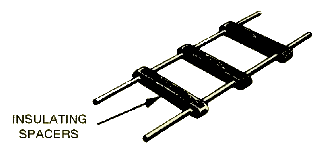

- Được sử dụng chủ yếu để truyền dữ liệu tốc độ thấp trong khoảng cách ngắn.
- Cấu tạo đơn giản gồm 2 đường dây song song nhau.
- Ứng dụng: anten râu.

**Ưu điểm:**
Cấu tạo đơn giản.

**Nhược điểm:**
Tốc độ truyền dữ liệu thấp (R ≤ 19Kbps).
Khoảng cách tối đa L ≤ 50m
Dễ bị tác động của nhiễu xuyên kênh (Crosstalk): do hai dây mắc song song nên từ trường của dây A sẽ tác động lên dây B và ngược lại.
Nhạy với nhiễu điện từ trường (EMI): một đường dây tạo ra từ trường tác động nhiễu tới dây A gần hơn dây B thì khi tới cuối đường dây tổng hợp lại sẽ không triệt tiêu được nhiễu.

| 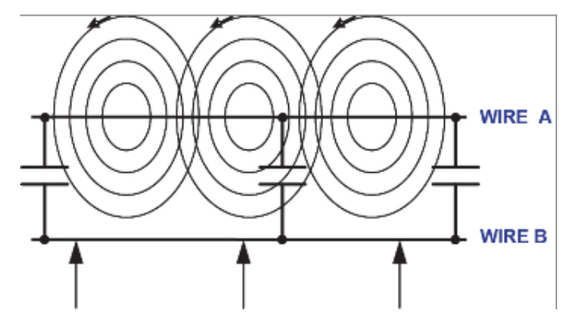 | !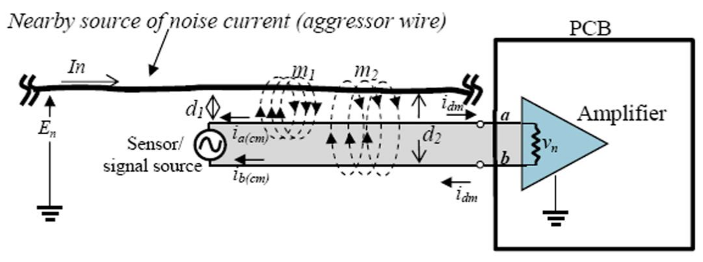 |
| ------------------------------------------------------ | ------------------------------------------------- |

### Twisted-Pair Cables - Cáp xoắn

[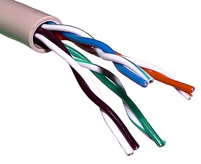](../media/twisted_pair_cables.png)

- Cấu tạo gồm các cặp dây xoắn lại với nhau.
- Ứng dụng truyền thoại hoặc truyền dữ liệu trong các hệ thống truyền thông tin. Chủ yếu trong mạng điện thoại và mạng LAN.

**Ưu điểm:**
Cải thiện khả năng chống EMI (nhiễu điện từ trường) so với two-wire open line: do cấu trúc xoắn nên hai dây sẽ luân phiên tiếp xúc với nguồn nhiễu từ bên ngoài và nhiễu sẽ bị triệt tiêu khi tổng hợp cuối đường dây.
Giảm nhiễu crosstalk (xuyên kênh) giữa các cặp dây: cũng do cấu trúc xoắn, nên các dây trong cặp dây A cũng sẽ luân phiên tiếp xúc với từ trường tạo từ cặp dây B và ngược lại.

| [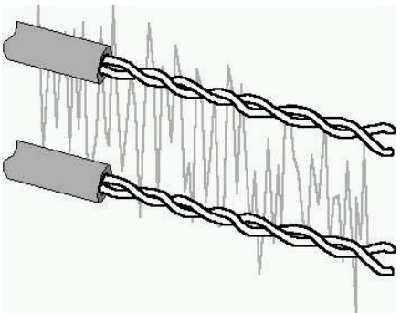](../media/twisted_pair_cables_crosstalk.png) | [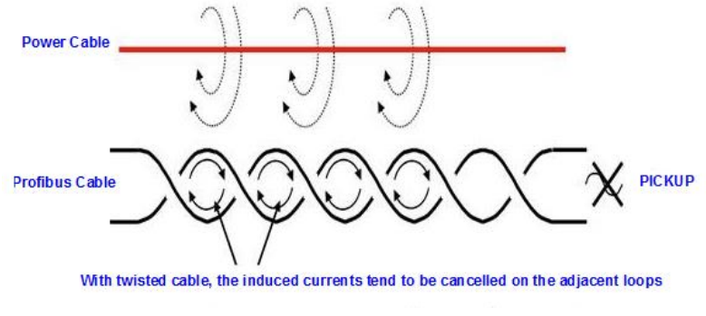](../media/twisted_pair_cables_EMI.png) |
| ------------------------------------------------------- | ------------------------------------------------- |

Có 3 loại cáp xoắn chính, khác nhau ở cấu trúc của nó:

**1. UTP - Unshield Twisted Pair** 

| [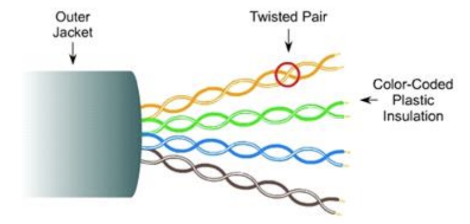](../media/unshield_twisted_pair.png) | [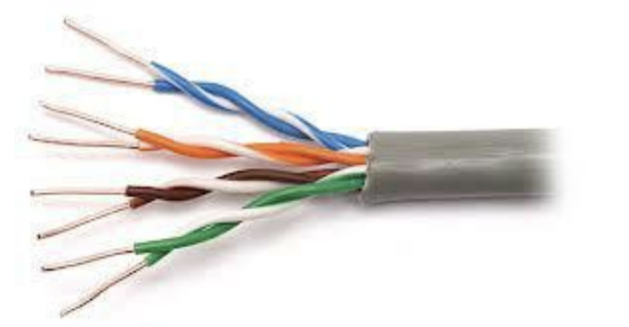](../media/unshield_twisted_pair_real.png) |
| ----------------------------------------------- | ---------------------------------------------------- |

- Trở kháng đặc tính: 100Ohm.
- Khoảng cách tối đa: 100m.
- Chi phí thấp.

**2. ScTP - Screen Twisted Pair** 

| [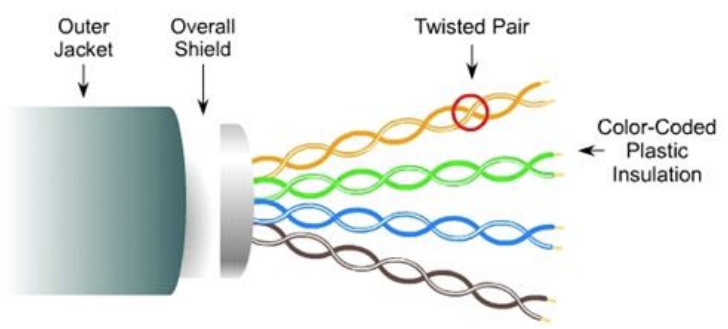](../media/screen_twisted_pair.png) | [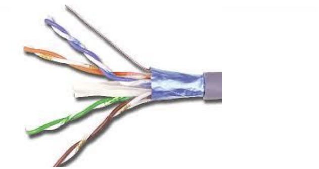](../media/screen_twisted_pair_real.png) |
| --------------------------------------------- | -------------------------------------------------- |

- Trở kháng đặc tính: 100Ohm.
- Khoảng cách tối đa: 100m.
- Chi phí trung bình.

Phần overall shield là kim loại giúp cách ly nguồn nhiễu từ bên ngoài.

**3. STP - Shield Twisted Pair** 

| [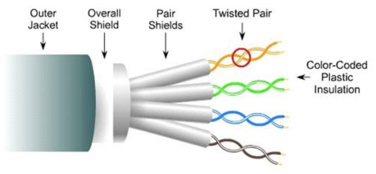](../media/shield_twisted_pair.png) | [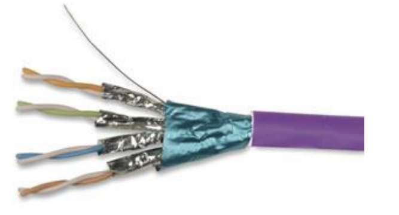](../media/shield_twisted_pair_real.png) |
| --------------------------------------------- | -------------------------------------------------- |

- Trở kháng đặc tính: 150Ohm.
- Khoảng cách tối đa: 100m.
- Chi phí cao.

Ngoài overall shield còn có pair shield giúp triệt tiêu nhiễu xuyên kênh giữa các cặp dây với nhau.

**RJ45 - Registered Jack Conector**

[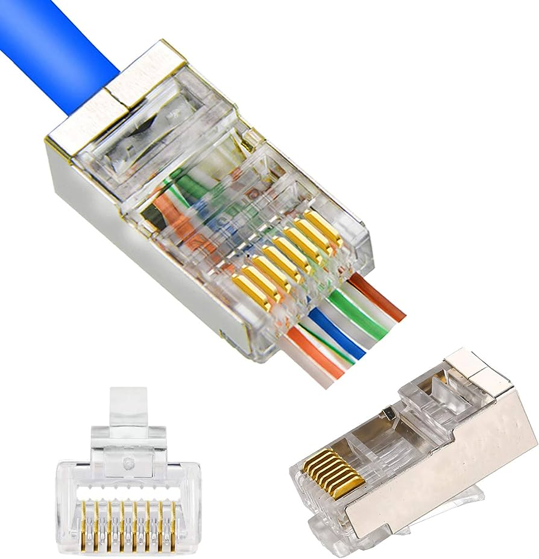](../media/RJ45_connector.png)

RJ45 có hai chuẩn nối T586A và T586B:

[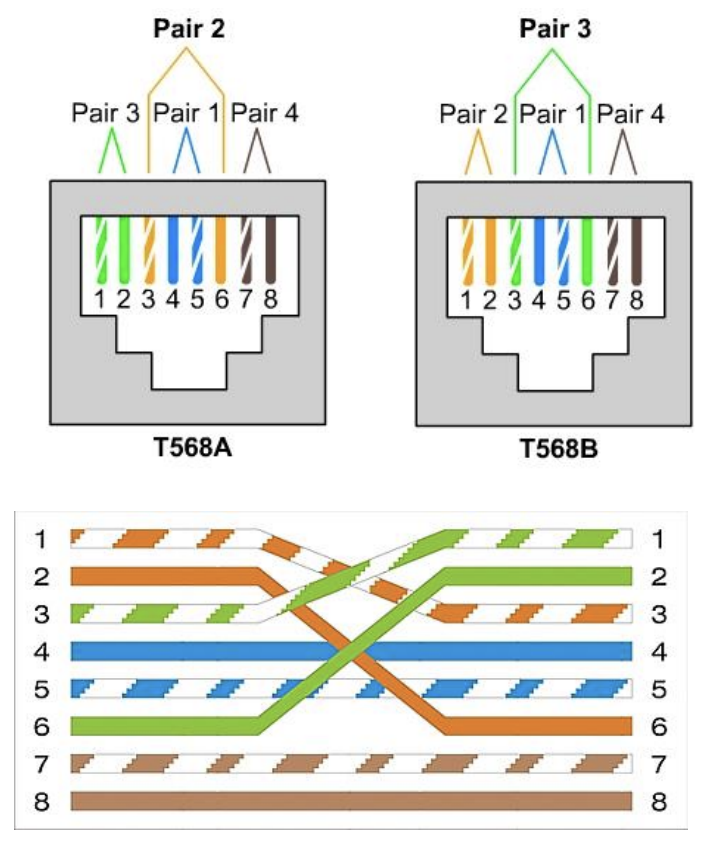](../media/RJ45_T586A_and_T586B.png)  

Hai chuẩn khác nhau ở thứ tự của các đôi dây, do TD--RD:

[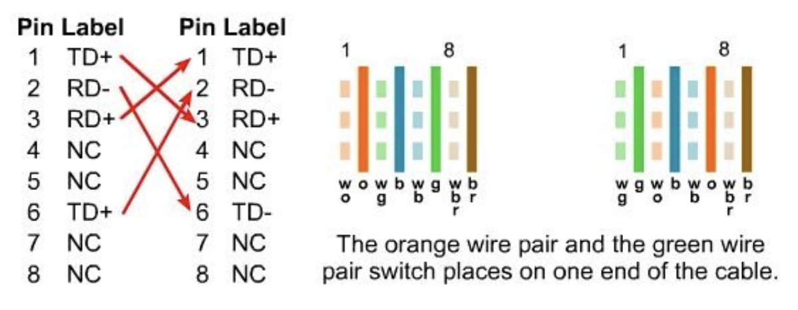](../media/RJ45_pin_lable.png)

**Mô hình cáp thẳng (1--1. 2--2 ... 8--8):**
- Switch--Router
- Switch--PC or Server
- Hub--PC or Server

**Mô hình cáp chéo (TD--RD):**
- Switch--Switch
- Switch--Hub
- Hub--Hub
- Router--Router
- PC--PC
- Router--PC

**Standard types of twisted pair cabling**

[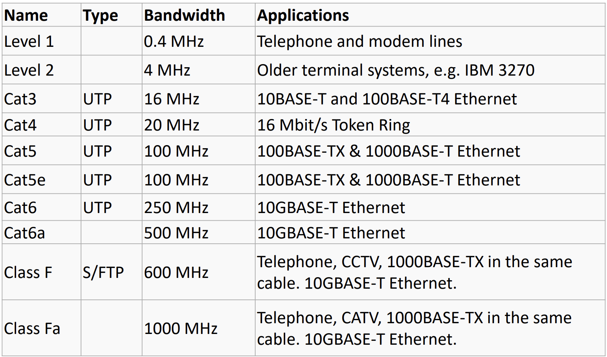](../media/twisted_pair_cables_standard_table.png)

### Coaxial Cables - Cáp đồng trục

[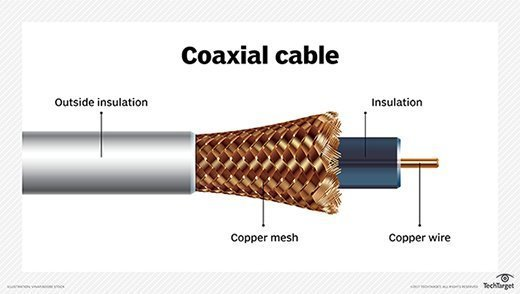](../media/coaxial_cables.png)

- Được sử dụng trong Computer Network, hệ thống truyền dữ liệu (Data Systems), CATV, mạng truyền hình cá nhân (Private Video Network).
- Cấu tạo gồm một lớp cách điện bên ngoài, lớp đồng bao quanh, lớp cách điện nhiệt, dây đồng truyền năng lượng.

**Ưu điểm:**

Chống nhiễu EMI tốt: do có lớp đồng bao quanh nên triệt tiêu được nhiễu từ nguồn bên ngoài.
Tốc độ truyền dữ liệu lên đến 10Mbps với khoảng cách vài trăm m.

**Nhược điểm:**

Có nhiểu trở kháng đặc tính khác nhau: nên với từng hệ thống có từng loại cáp đồng trục riêng.

**Có 3 loại cáp đồng trục chính:** được sử dụng cho các ứng dụng khác nhau.

**1. RG-6/RG-59**

- Trở kháng đặc tính 75Ohm
- Sử dụng trong các hệ thống CATV

**2. RG-8/RG-58**

- Trở kháng đặc tính 50Ohm
- Được sử dụng trong mạng Thick Ethernet LÁN hoặc Thin Ethernet LANs

**RG-62**

- Trở kháng đặc tính 93Ohm
- Sử dụng trong các máy Mainframe IBM.

[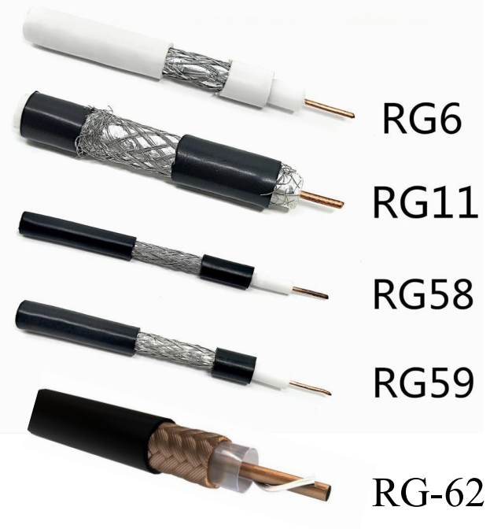](../media/coaxial_cables_all_type.png)

### Optical Fiber Cables - Cáp quang

- Ánh sáng được sử dụng trong cáp quang là một loại năng lượng điện từ.
- Bước sóng của sóng điện từ được xác định bằng tần suất điện tích tạo ra.
- Cáp quang sử dụng tính chất phản xạ và khúc xạ của ánh sáng.
- Ba bước sóng chính được sử dụng để truyền dẫn trong cáp quang là 850nm, 1300nmm và 1550nm. Những bước sóng này có độ suy giảm trong sợi thấp nhất.
- Độ dài bước sóng ảnh hưởng trực tiếp đến tỉ lệ suy giảm của tín hiệu - bước sóng càng dài, độ suy giảm càng ít.

[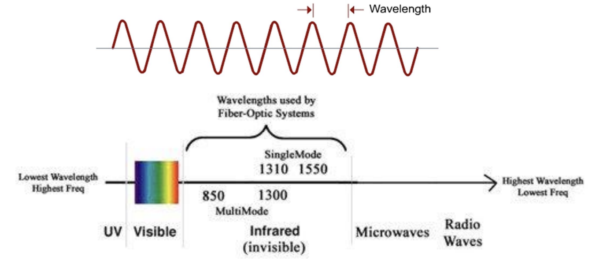](../media/optical_fiber_cables_wavelenght.png)

[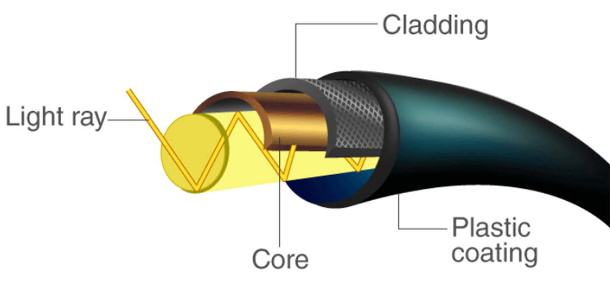](../media/optical_fiber_cables_structure.png)

**Ưu điểm:**
Tốc độ truyền cao, băng thông rộng.
Khả năng chống nhiễu rất cao.

**Nhược điểm:**
Giá thành cao: chế tạo lớp clading có chiết suất mong muốn và lớp lõi thủy tinh rất nhỏ và giòn.
Lắp đặt phức tạp: dễ đứt gãy (góc < 125 độ>), khi xảy ra hiện tượng đứt gãy thì rất khó nối lại (phải sử dụng máy hàn cáp quang rất mắc tiền).

**Cáp quang gồm 3 loại chính:** có 2 dạng là multimode và single mode. 

**1. Step Index Multimode:** Khoảng cách lên đến 500m.

[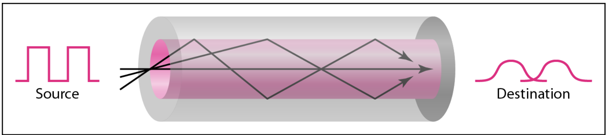](../media/optical_fiber_cables_step_index_multimode.png)

Dạng tín hiệu ra bị méo dạng và biên độ bị suy hao.

**Cáp quang gồm 3 loại chính:**

**2. Grade Index Multimode:** Khoảng cách lên đến 1000m.

[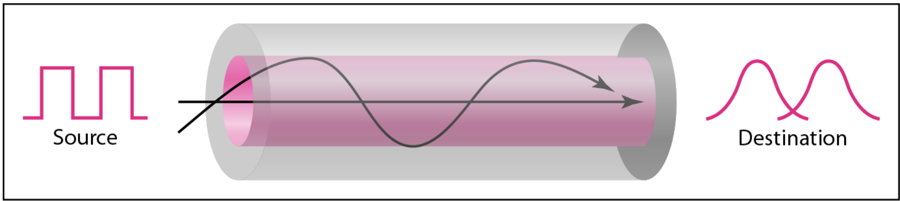](../media/optical_fiber_cables_grade_index_multimode.png)

Dạng tín hiệu ra bị méo dạng và biên độ ít bị suy hao.
Lõi được tạo ra từ các lớp chiết suất khác nhau, tất cả được phản xạ toàn phần, khôi phục bằng cách tập hợp tất cả các tia lại, do đường đi khác nhau giữa các tia sáng nên tín hiệu khôi phục vẫn có méo dạng.

**3. Single Mode:** Khoảng cách lên đến vài km.

[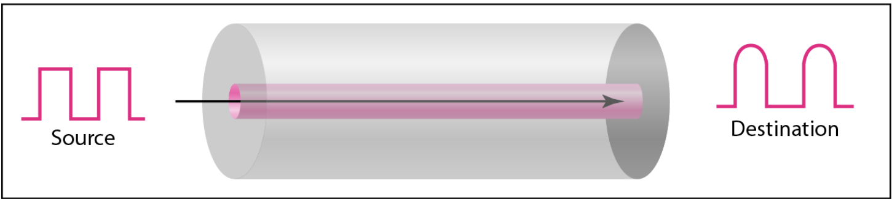](../media/optical_fiber_cables_single_mode.png)

Dạng tín hiệu ra ít bị méo dạng và biên độ ít bị suy hao.
Tiết diện lõi truyền tin nhỏ, năng lượng tập trung vào một tia duy nhất, nên tín hiệu được khôi phục một cách tốt nhất.

**Nguồn sáng tín hiệu:**

- Nguồn LED tạo ra ánh sáng hồng ngoại có bước sóng 850nm hoặc 1310nm. LED được sử dụng trong multimode.
- Nguồn LASER tạo ra chùm sáng hồng ngoại cường độ cao thường có bước sóng 1310nm hoặc 1550nm. LASER được sử dụng với single mode.

Thực tế single mode sẽ phổ biến hơn do công nghệ ngày càng phát triển làm cho chất lượng và giá thành ngày được cải thiện.

[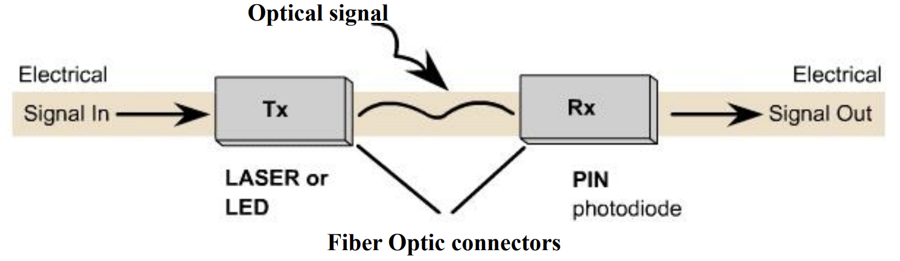](../media/optical_fiber_cables_signal_source.png)
