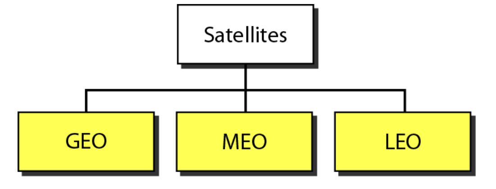
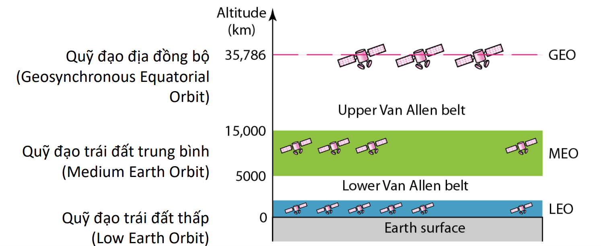

# Wireless Media - Truyền dẫn không dây

### Satellite Microwave - Vi ba vệ tinh

Vi ba vệ tinh được chia thành 3 loại. Dựa vào khoảng cách từ vệ tinh đến mặt đất.

Vi ba vệ tinh được dùng trong:

- Phát thanh, truyền hình.
- Điện thoại đường dài.
- Mạng cá nhân (Private)